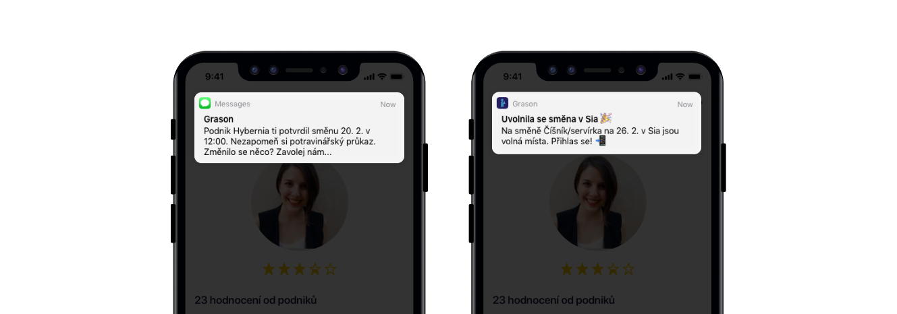
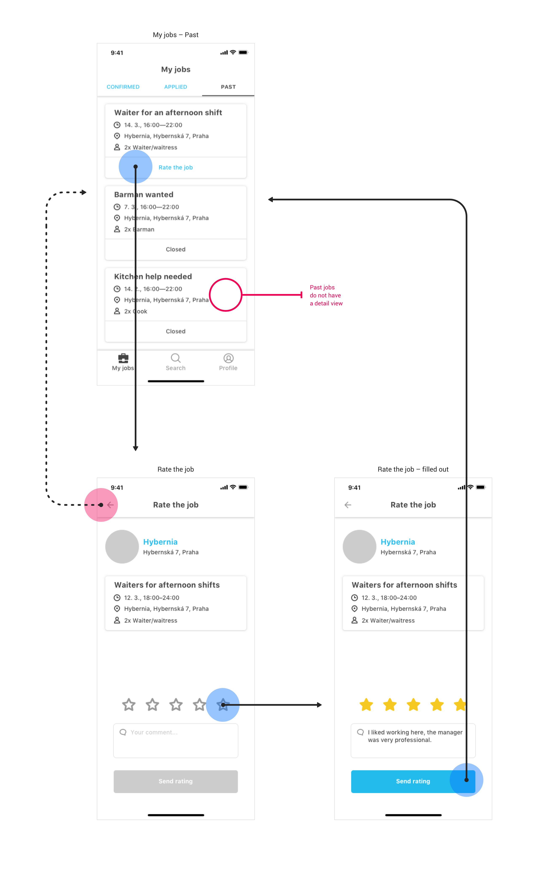

## About Grason

Grason creates a job marketplace in the hospitality industry.
The service connects restaurants with staff on demand. Restaurant managers create temporary job ads and waiters, bartenders or other staff apply. The company's vision is to connect quality restaurants with dependable staff.

## My role

- User research
- Interaction design
- Prototyping

## Team

I worked with Grason founders and product team at Futured (formerly The Funtasty): engineers, UI designer and QA.

## Goal: Get to market with mobile apps

Grason initially launched a web-based MVP in Autumn 2017. They validated the concept with it but learned that their users needed to create and respond to job ads on the fly – the web app wouldn't suffice. The founders approached Futured, the agency I worked for at the time, and I took the role of a UX Designer on the product team.

The goal was to get to market as soon as possible with mobile apps on iOS and Android. The caveat was that both target audiences (restaurant managers and staff) needed their own interface. I was tasked with designing the user experience of both apps.

## User research

Understanding of both target groups was necessary for designing a good experience. I conducted user interviews with staff and restaurant managers and documented the insights in the form of personas.

We found out that, among other things, managers were looking for reliable staff constantly. Their biggest pain points were no-shows and staff coming in the wrong dress code.

On the other hand, the staff was looking for gigs to earn extra money in their free time. They always had their phone with them, but didn't like to call – they prefered texting. They also feared that they wouldn't get paid at the end of their shift.

Such findings informed many of the design decisions.

## Interaction Design

A key technological decision was made early in the project – to create one app that would serve both groups of users. This would enable the team to ship the app in a shorter timeframe. It was also a design constraint that I had to work with.

### Onboarding: Show value as soon as possible

Onboarding is always a key moment in the product experience and so I asked: how could we show people the value of our service as soon as possible?

Because restaurant managers were onboarded by the salespeople manually, this was focused on the staff. The solution was to show them job listings first and get them to sign up only when they wanted to apply.

The sign-up process was designed to include phone number verification because having the correct number is critical for sending key SMS notifications and for providing contact for managers. It also included steps that help staff build their profile and be ready to apply for jobs right away.

### Keeping users informed

It's important for staff to find out about new gigs (especially when they're last minute) and whether a manager accepted their application. On the manager side, it’s vital they react to staff applications as soon as possible.

Based on our user research insights, we decided to use two types of notifications:

SMS for information that should never be missed (e.g. confirmed job). To prevent no-shows we would send a reminder text to staff on the day of the job.
Push notifications for information that is of second priority (e.g. rate your latest job).
Our philosophy was to send less notifications, but better targeted – to send relevant information and don’t overwhelm users. I designed decision trees for determining when to send certain types of notifications and to whom. I also wrote their copy.

### Apply for a job in few taps

One of the key flows in the app is when staff applies for a job. We gave them the freedom to set their own hourly rate and also ask managers questions in comments.

We later learned that staff was sometimes forgetful and would apply for two jobs that overlap—to prevent no-shows we added a feature where staff is automatically withdrawn from a job when they're confirmed for an overlapping one.

### Rating without effort

Providing feedback is important for both sides, because overall rating helps managers choose the best staff and it enables staff to choose to work in nice environments.

We designed a very simple rating mechanism where staff and managers can provide feedback shortly after a job has ended—either just on a 5-star scale or also with an optional note. I integrated it into the app design to be the primary call to action on past jobs.
Documenting the design
I used wireflows for documenting interactions within the app. It’s become my preferred way of documenting flows.

It allows me to lay out interactions visually and to switch between digging into the details and looking at the big picture. This form of documentation was also well received from developers.

I also relied on the concept of a UI stack to document all necessary states and interactions.

## Shipping

I worked very closely with the rest of the team to make sure we shipped the app as soon as possible.

That included supporting the UI designer as well as engineers during development.

## Further development and evangelizing UX

The app launched in May 2018 for iOS and Android, but my work didn't end with the release. I stayed on the product team for another year and helped with designing and shipping several additional features and improvements.

I also initiated a usability testing study to validate some new design ideas of features that were under development. I made a point in inviting our developers to observe in an effort to evangelize UX in the team. It proved very interesting for them and enabled the team to be more efficient in discussing some design decisions.

## Results

Since launch the app has grown steadily, onboarding new businesses as well as growing their staff network. It has gained some attention from local media as well. But most importantly, it has been successfully fulfilling its vision of connecting staff with restaurants:

- Hundreds of jobs monthly
- Minimal no-show rate
- Managers are happy with staff (over 4.7/5 average rating)

Hats off to everybody on the team working on this.

- **4.6** Rating on the App Store
- **2.5 million CZK** Earned by staff through Grason (AS OF 03/2019)
