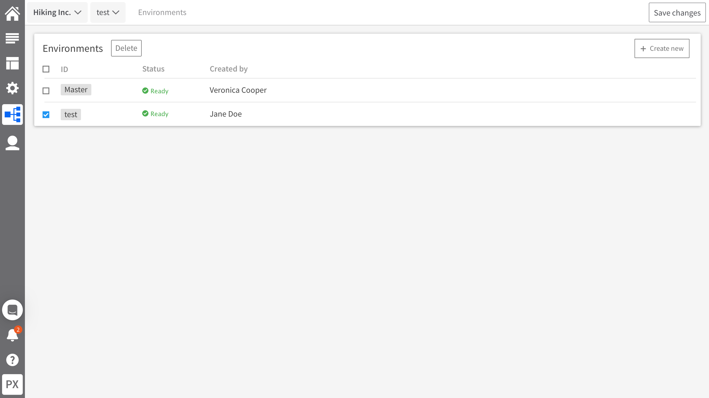
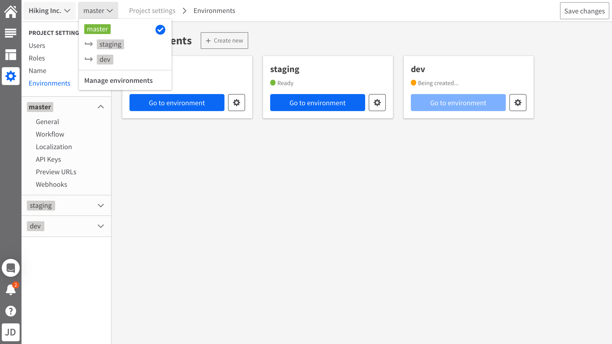
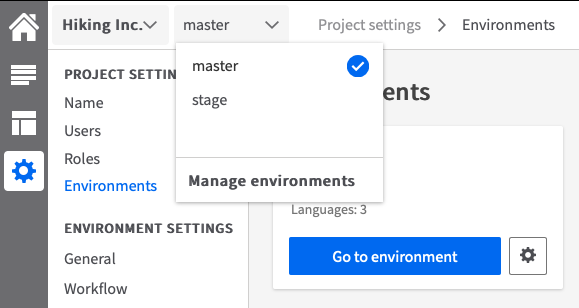
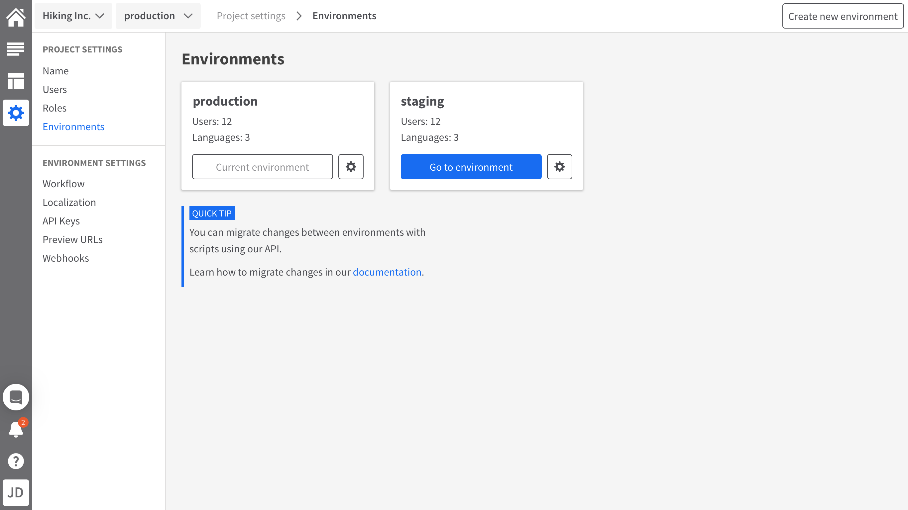
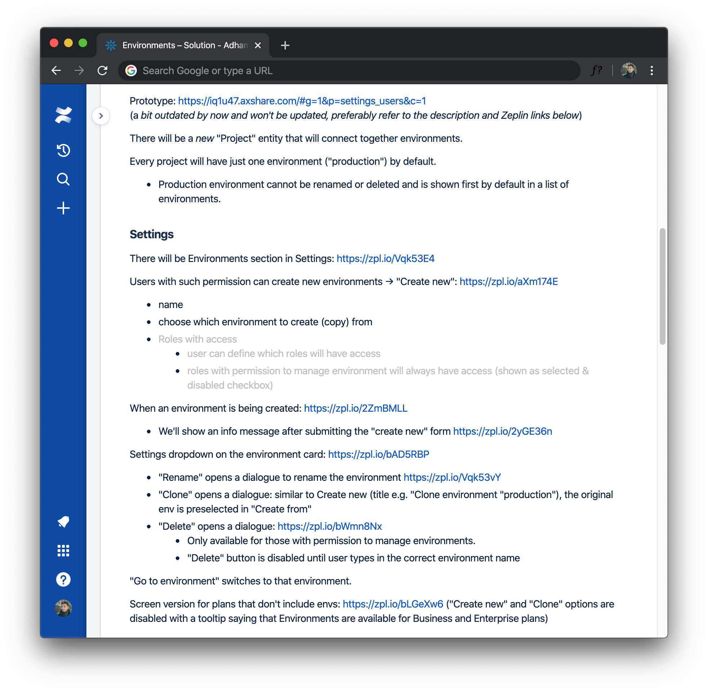
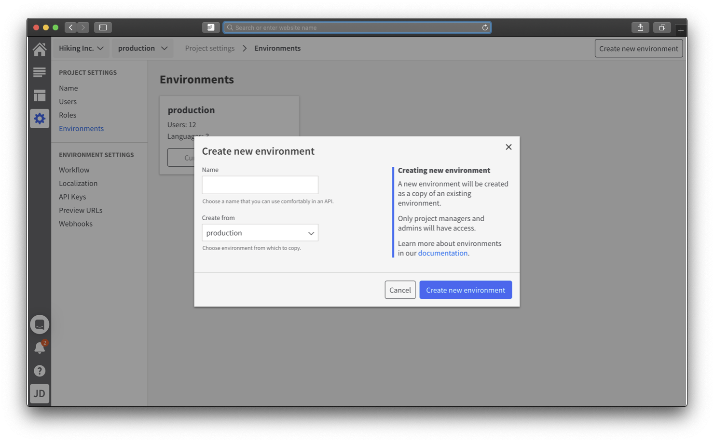

## Summary

- We needed to **give developers working with Kentico Kontent a safe way to develop new functionality without breaking anything**.
- We did that by shipping **environments**: a feature that creates a safe space for developers to work in.
- I worked with a product manager and a product team of 4 engineers.
- The shipped feature was **validated with users** and since then **successfully adopted by enterprise customers**.

For more in-depth account, read on.

## Product and audience

Kentico Kontent is a content management platform with a headless CMS at heart. As a B2B SaaS, it enables companies to work with content in one place and distribute it to all their channels (websites, apps etc.). The main audience of this project were developers integrating this system into those channels. They are an important user segment as they can become advocates for the product in companies.

## Problem: Developers needed to make changes without breaking a live website

In Autumn 2019, developers were missing the ability to have multiple environments of projects. Why is that important?

Developers often **need to add new functionality to a website or change an existing one, which also means they need to update the content models** in Kentico Kontent and that can result in breaking the website. Developers also need to run separate instances of their websites: typically one for development, one for testing and a live one.

Environments would enable them to do that by creating a safe space for testing and migrating those changes that work without problems.

**Lack of this feature was also among common reasons for losing potential customers to competitors. Adding this to the product would, therefore, help the product be more competitive.**

## My role

One of the product managers reached to the team he needed a designer for this project. I took this opportunity to get involved.
My responsibility was to **design the management of environments in the product and validate it with users**. I worked primarily with the development team dedicated to this project and the product manager, but I also consulted my design decisions with the UX team.

## Researching the problem space

There were previous efforts to build this feature so I didn't start from scratch. I studied usability testing results of a previous design carefully to determine what to focus on when iterating on it. I learned that developers had a hard time understanding the hierarchy of "projects > environments" in the UI and also some key functionality (such as deleting environments).

As this was a highly technical topic, I dived into reading about development workflows and I also discussed with the team to understand the problem space better. Since the product manager has previously conducted some research among our users-developers on this, I studied it to understand their needs and circumstances.

The main need was clear: to be able to develop some changes and test them safely. Developers mainly feared to break something in the live website or app.

I knew that developers didn't spend nearly as much time in our product as content editors. They would seldom go there, so the UI had to be intuitive for them. An important part of that was establishing a mental model of the functionality. But we needed also to establish a model of the underlying technical solution which might've posed constraints on the design.

## Uncovering constraints and ideating solutions with the team

I facilitated a workshop with the team to involve them in the design process. We explored what the underlying technical model could look like. Which entities (e.g. users, content models etc.) would be on which level (figure 1 below). This helped me see what kind of technical constraints I would have to work with.

Establishing the model was also important for designing the navigation. During the same workshop, I led an ideation session for coming up with ideas for the navigation (figure 2 below).

<i>Figure 1 (Left): Technical model draft; Figure 2 (Right): Navigation sketches</i>

## Interaction design

Armed with ideas from the ideation workshop, I started working on the interaction design of the whole feature. I started with defining the main use cases:

- Create a new environment
- Delete an environment when it's no longer needed
- Switch between environments

It became clear that easy access to the environment management was necessary. A project dropdown already existed in the UI and the navigation ideas usually centred around either incorporating environments into the existing dropdown or into a separate one.

I made the decision to use a separate dropdown for environments as my hypothesis was it would better support the mental model of "projects > environments" and also provide space for a quick access button to environment management.

I explored several avenues for the placement of the environments management section. One of them was the main menu (figure 3), but it would introduce too much complexity into the navigation.

Ultimately I decided to place the management into settings (figure 4) as it would help establish the hierarchy even further by showing which entities are set up on the project level and which on the environment level. Another reason for this decision was that development-related settings were already there.

<i>Figure 3: Navigation to Environments in the main menu</i>

<i>Figure 4: Navigation to Environments in the Settings section</i>

It was important to distinguish between settings on the project level and on the environment level. I solved this by clearly separating the Settings menu to Project settings and Environment settings.

The last question mark was the naming of environments. We knew there would one by default that couldn't be changed (at least in the first release of the feature). There were several possibilities for the name: live, production or master. Initially, I decided for "master" as it's a familiar term for developers and therefore seemed like a good fit, but usability testing would prove me wrong later. Other environments could be freely named as users would see fit.

## Prototyping for usability testing

As my role was to validate the design with users before releasing it, I started organising a round of usability testing. I formed hypotheses we wanted to test:

- **Users understand the hierarchy of projects vs environments** when interacting with the navigation (especially in Settings).
- **Users have no difficulties managing environments** (e.g. creating new, deleting, switching between them etc.).

With the help of our researcher, I designed test scenarios. Based on them I prototyped the solution, but I limited the prototype only to what was necessary to test my hypotheses.

<i>Figure 5: Detail of the navigation dropdown in the prototype</i>

My tool of choice was Axure as it enabled me to work with variables. The prototype had to change the environment name in the navigation elements pictured above (as it would in a real product) so that users wouldn't be needlessly confused during testing.

[Check out the whole prototype.](https://iq1u47.axshare.com/#g=1&p=settings_environments&c=1)
_(note: the prototype has been iterated since the usability testing based on the insights)_

## Usability testing

I recruited developers from our respondent pool and conducted remote usability testing sessions with them. It was very fruitful and it led to several results:

- Proved that the separate dropdown and the whole navigation worked well.

  - Developers understood the hierarchy and navigated around the system with the new functionality without problems. The "Manage environments" shortcut in the drop-down was used by pretty much everyone to navigate to the relevant Settings section. It helped with navigation a lot.

- "Master" didn't really work as name for the default environment.

Developers associated it with a git workflow which wasn't exactly the mental model we needed here. Based on this, we later changed the name to "production" as a more appropriate term.

There were a couple of other smaller insights into how the UI could be improved to be more intuitive. More importantly, though, we received good overall feedback and validated that the interaction design as a whole worked with only minor changes necessary.

I gathered the team to share the testing results with them. I wanted to create a shared understanding of the changes I was about to make to the design. The aim was also to strengthen the idea of how important user feedback is during the design process.

## Iterating based on real insights

Iteration is an important part of the design process. With insights from the usability testing, I worked on improving the design. Most of the changes involved writing a clearer and more concise copy which I worked on with a technical writer to perfect.

I also submitted the whole solution for a design review from the UX team to identify any other possible issues.

In the end, several things in the design changed. For example, the naming of the default environment went from "master" to "production" to avoid association with a wrong mental model. I also removed the accordion navigation (see figure 2 above) to simplify the whole navigation panel as it caused some minor confusion during testing.

Then, the design was ready to be groomed with the development team.

<i>Figure 6: Environments management section after a few iterations</i>

## Grooming with the team

The team and I gathered for a whole afternoon to examine the design from a technical perspective. We discovered potential difficulties and identified several ways of implementing the feature. They were all tied to how the underlying technical model would look like.

We agreed on an implementation that would allow the earliest possible delivery without compromising the interaction design we worked so carefully towards.

We also defined several ways of evolving the functionality in future releases. One of them was the colour coding of environments – while users found it interesting during the testing, we decided it was not necessary in the ETP (earliest testable product) version.

I documented the whole solution in a handoff document for the team describing all the interaction details with including links to visuals in Zeplin. I made sure to capture all the different states of screens in the design.

<i>Figure 7: Preview of the handoff document with the detailed solution description</i>

## Validated design ready to be implemented

This was a really technical design challenge and it was a lot of work, but we ended up with a design that was:

- Small enough to be shipped early
- Validated thoroughly with users
- Accommodating various technical constraints

The first point was especially important as this was a highly requested capability in the product and we wanted it to deliver it to the customers as soon as possible.

## Shipping and impact

It took us about two months to go through the design process. In the meantime, the team worked on some technical capabilities of the product that would be required for this feature. Then in May 2020, we shipped environments to our customers.

As the release date neared, I also participated in a webinar where our head of marketing, product manager and me introduced the feature to our customers.

Since the release, several enterprise customers adopted this feature. It greatly improves the developer experience of Kentico Kontent and makes the product more competitive.

[Read a guest blog post on Kontent.ai](https://kontent.ai/blog/deployment-with-kontent-environments) where a CTO of one of the customers talks about this feature.

## What I learned

### Make the team a part of the design process

Developers have good design ideas. Especially when it's about a feature that's highly technical and complex like this one was.

Having a shared first-hand experience during the usability testing makes communication around the whole design much easier.

### Usability testing can always prove you wrong

Sure, it confirmed some of the hypotheses but revealed some gaps in the design. I could've easily said I fixed all the issues that arose during the testing of the previous design. However, by testing the new design again I still gathered some important insights.
