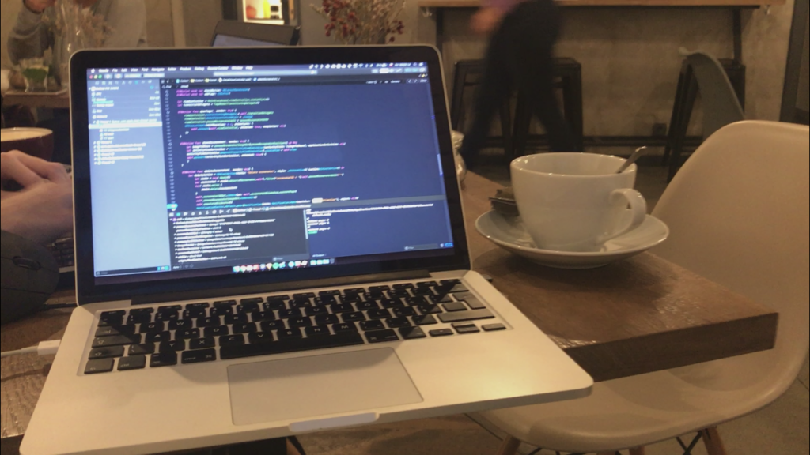

I previously wrote that I'm [learning to code](https://amran.cz/why-im-learning-to-code), because I believe the future of design tools is based on code. Well, I didn't tell you the whole truth. There's also a second powerful reason why I embarked on this journey. It's the idea of being a maker.

I believe that coding gives you superpowers. It can take you from being "just" a designer to being someone who can release actual products into the world.

I want to have a bias toward action. Coding is a way there.

To prove that point, here are two personal stories of how I used my ability to code—albeit very limited—in the past.

## Building a side project

A couple of years ago, [I built a simple iOS app](https://amran.cz/work/collect). From the moment I conceived the idea to the moment I started building it, almost a year passed. Initially, I just designed a concept for it and tried to validate it. That was a good first step, but once I had the concept ready, I had to decide which path to take next:

Team up with a developer or develop it myself.

The first path seems easier as all you have to do is find the right person and they will do all or most of the scary-looking coding part. The second path requires you to roll up your sleeves, learn a programming language, get familiar with the underlying technology and do the hard work yourself.

Definitely the less comfortable path. So I chose it.

It wasn't easy by any means, but it was the first step to becoming a maker. And that's what I really wanted. **Being able to create something and give it to the world without waiting around for anything or anyone**.

_Working on my iOS app_

Despite it being a very simple app, it took me months to finish it. When I started, I had close to zero knowledge about developing iOS apps or the Swift language. That didn't stop me and I was "learning on the job".

There were moments I was hitting the limits of my skills very hard, but at the same time I kept pushing them. There were moments of frustration followed by moments of immense joy when I solved a problem.

In the end, I successfully released the app. And [I learned a ton](https://amran.cz/what-i-learned-as-a-designer-from-building-an-app).

It was my decision to code it myself that made this project so valuable for me. I proved to myself that I can code when I decide to. I can start a side project and get it done. I don't even need to have all the coding skills beforehand. I learned some basics and I can build off of that. And that's a very powerful thing to have.

## Delivering a feature without touching the product

In 2019, I turned my focus towards learning Javascript. I made a career transition from mobile apps to a web-app product and I figured Javascript would be more useful. Indeed, that proved to be true.

Once you acquire enough skills and knowledge to be able to make something, you start seeing opportunities to innovate or improve things around you. And that's where my second story comes from.

When I joined Kentico, I started to work on Kontent—a content-as-a-service platform. Big part of the product is about creating content.

Copywriters go there to draft blogposts, articles and other content. And for that, it's good to have focus. But there are parts of the UI that can be distracting and you don't need them when you're writing.

We knew that in our team and there were plans on introducing this to the product. As I saw some mockups for it, I realised that this actually shouldn't be hard to do. All you need is to hide a couple of elements—basically a simple mode to turn the hiding on and off.

I wouldn't dare to develop this directly in the product as I didn't have enough knowledge to get involved in the whole development workflow. But I knew just enough not to wait around and build it. I knew that a small browser extension could do the job.

I explored how Chrome extensions are made and I got to work. In a single day, using a very helpful [tutorial](https://developer.chrome.com/extensions/getstarted), I was able to develop and release that extension.

https://twitter.com/KenticoKontent/status/1230099780405223424?ref\_src=twsrc%5Etfw

It enables writers to turn on a zen (or focus) mode that hides parts of the UI they don't need for writing. That's it. Nothing fancy.

I'll spare you the technical details, but the whole thing is just maybe a hundred lines of code.

Is the code pretty? Probably not.

Does it work? Absolutely.

Since it's so simple, it was possible to build it quickly. What you don't see though, are tens of hours of learning JS I spent in the months leading up to this. It was that work that allowed me to see the opportunity for this mini-project.

## Being a maker

Projects like these are exactly the kind of stuff I want to be able to do. I don't want to wait around for others to deliver value to people.

When I say that coding gives you superpowers, there are actually two I have in mind:

1. Being a self-starter
2. Seeing opportunities

When you start learning that skill, you start to get ideas for what you can make. And since you have that skill—or the belief you can learn it—it allows you to start by yourself.

And that's why being a maker appeals to me so much.
