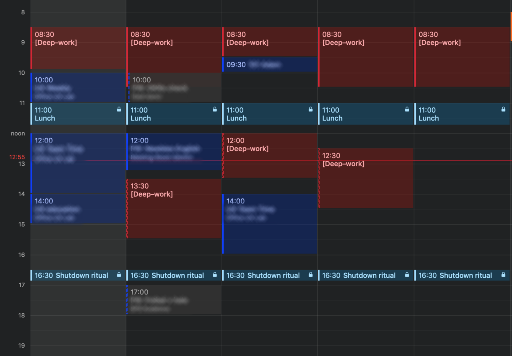
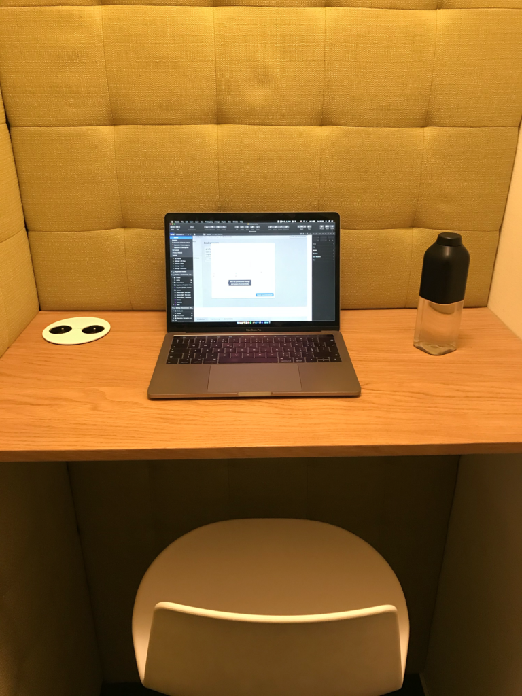

Cal Newport argues in his book Deep Work that this skill is increasingly rare and valuable. Those who master it will thrive. I've been trying to practice working deeply for a while now. When I first read the book, I missed some personal accounts from people who adopted deep work.

How does it look in practice? What works and what doesn't? Here's what I do to work deeply. Maybe you'll find some inspiration in this.

## What is deep work

Just so we're on the same page about what deep work is, here's how Cal defines it:

> _“Professional activity performed in a state of distraction-free concentration that push your cognitive capabilities to their limit. These efforts create new value, improve your skill, and are hard to replicate.”_

From a product designer's perspective, that's activities like designing UI, prototyping, writing or analysing research.

Its opposite is shallow work:

> _“Non-cognitively demanding, logistical-style tasks, often performed while distracted. These efforts tend to not create new value in the world and are easy to replicate.”_

That's typically replying to emails, scheduling meetings or chatting on Slack.

Working deeply is about prioritising those cognitively-demanding tasks over those you can do half-distracted.

## How I practice deep work

There's a lot of advice on what to do specifically to work deeply. You can find many guides that distil the book's content. The best one I know is "[The Complete Guide to Deep Work](https://doist.com/blog/deep-work/)" on Doist's Ambition and Balance blog. If you're looking for general advice on how to apply deep work, check it out.

I'll continue with what I've been practising and experimenting with in my own life.

### Scheduling Strategy

Being very intentional with your time is a core principle of deep work.

When I first tried working deeply, I made the mistake of not picking a scheduling strategy. I unintentionally used the journalistic philosophy – fitting deep work whenever available in an existing schedule.

Alas, it didn't work for me at all. I would seldom find a longer time period to really get into the flow as my schedule was often plagued with meetings.

I later adopted the rhythmic philosophy. I started to schedule in advance long recurring blocks of uninterrupted time. In a sense, I took my time back. These blocks prevent others from easily putting a meeting into a middle of my day.

_What my typical week looks like with deep work sessions scheduled._

The morning blocks are typically non-negotiable. I am more strict about reserving those for my most important tasks. I am more flexible about the afternoon blocks so that when the rare important meeting comes up, I can find the time.

The journalistic philosophy comes back into the picture here. I use it as a complementary philosophy to the rhythmical one – when a recurring meeting is cancelled, I usually fill it with deep work

There are two other philosophies of scheduling deep work: monastic and bimodal. Both require long time stretches of blocked out time – weeks/months in the bimodal and all the time in the monastic philosophy. That's a more extreme approach and not something I've considered or even tried (yet).

### Deep work environment

Our environment has a profound impact on how we work. Just think about the difference between a noisy open-space and a quiet personal office. Imagine the volume of deep work you could do in both.

The open-space used to be my arch enemy. Even though I don't work in a one anymore, sharing the office with several other people is not always conducive for deep work. Here's what I do:

As much as possible, I try to find a space where I can be alone. Just me and my work. Here's an example of such a space:

Being alone does wonders to my productivity. Spaces like the one pictured above ensure minimum distractions.

From time to time, I also work from home or from a café. In addition to the physical location, I use noise-cancelling headphones (Sony WH-1000MX3 – terrible name, awesome headphones) to block out conversations and other noise.

### Music

Speaking of headphones, I've been experimenting with what kind of music works best for me. I found that it has to be instrumental. Any voice is distracting for me. Lately, I've been a fan of the "[Writing flow](https://open.spotify.com/playlist/62zaWgEWM3DjoXygxhksmS?si=BMPBGqyCQv-4_wTkQoSKCw)" playlist by Julian Shapiro – full of great instrumental music that I can easily focus to.

One trick that I do is that I find a track I like and I play it on repeat. When there's no novelty in the music, it frees up cognitive space.

### Phone and notifications

I have 90% of notifications on my phone turned off. It's always on silent when I work and facing the screen down. And sometimes, I put it away completely in my bag so that I don't feel tempted to reach for it.

### Computer setup

The computer setup is a bit more tricky to get. There is an infinite number of distractions. What works best for me is the following:

- Single screen or one external monitor max.
    - I've been trying out a second external monitor lately, but it's been more distracting than helpful so I'll probably go back to a single external monitor or just my Macbook.
- Full-screen whenever possible. Or at least hide the dock.
    - Out of sight, out of mind. When I don't see other apps' icons, I'm less tempted to switch.
- Distraction blocking software (Freedom and Cold Turkey)
    - When I need to be really strict with myself, I block distracting websites for some time period until I get my deep work done.

### Internal distractions

You can block out as many external distractions as you want, but you can't run away from your internal ones. You know, those random thoughts that keep popping up in your head. This is probably what I struggle with the most.

My brain has a tendency to reach for a distraction whenever I work on a task and I'm unsure what exactly I should do next. In these moments, I often find myself checking Twitter or a team chat.

I'm also working on strengthening my focus muscle. One way of doing that is meditating every day. And practising deep work itself is another. But this is a long process and I have to be patient with myself on this.

### Planning ahead

I already told you that I use mostly the rhythmic philosophy to work deeply by scheduling blocks of time in advance. Another aspect of planning is also about the work itself.

I try not to show up to a deep work session and start by looking at my to-do list. When I can, I decide in advance on what I will be doing. I believe that being more specific about what I'll be doing helps.

I break down my tasks into more actionable sub-tasks which also helps remove any uncertainty about them and reduces my tendency to procrastinate.

### Type of work

Let's also look at what kinds of activities I apply deep work to. As I mentioned, deep work is:

> _"Professional activity performed in a state of distraction-free concentration that push your cognitive capabilities to their limit. These efforts create new value, improve your skill, and are hard to replicate.”_

Some specific activities that I consider deep work are:

- doing research (doing a secondary analysis of existing research, defining research design, analysing research data)
    - by contrast, contacting research participants (typically by email) is shallow work for me
- designing UI mockups
- writing a design specification
- reviewing others' designs
- writing an article or preparing a presentation

Since my job is designing digital products, I can only specific to that but you can get a better idea of what deep work might be.

### Timing

A small struggle that I've had with scheduling is that I don't always get the deep work session length right. Sometimes I finish earlier – that's the better outcome. Other times the scheduled block is not enough and I need more time to finish the task.

If my calendar is free after the session, I continue working. More often though it's not and I need to come back to the task later or even another day. That breaks my focus and I need to spend a considerable amount of time when coming back to the task to get back into the flow.

I haven't found a solution for this yet but I trust that my ability to estimate more accurately will improve with practice.

### Rituals

Cal Newport recommends having routines or rituals in place to help you get into the state of focus or disengage at the end of the day. I've adopted a shutdown ritual that I do when I wrap up my workday.

When I finish my work I open up my to-do list app (I use Todoist) and clear out anything that's left over from the day (usually schedule it to another day or delete the task if I no longer need to do it).

I then look at the next day and plan what I'll be working on. I check my calendar for any meetings and I dedicate one or two deep work sessions to the most important tasks. That's the moment I close the laptop and head home.

This kind of routine helps me to leave work at work. I'll admit I often work on something personal when I get home (e.g. write this blog), but even then I stop before 6 PM. It's good to have a boundary between work and personal life.

## Practical tips

This has been an overview of what does and doesn't work for me when it comes to deep work. I want to leave you with some more general and actionable tips that you can try yourself.

### 1\. Get the foundations right

I haven't talked about this but there are three key things to get right before anything else.

The most important is sleep. You absolutely need to sleep enough to keep yourself healthy. I typically get 7-8 hours every night. Only rarely do I sleep less and when I do the next day is usually no good.

Then it's nutrition and exercise. It's important to move regularly (I lift weights; you do you), eat healthy food and drink plenty of water. Plenty of advice out there on this so I won't go into detail.

### 2\. Isolate yourself

This is what helps me the most. It doesn't have to be total physical isolation though – I can get plenty of deep work done in a café. What matters is that you're not being distracted by other people. On the most practical level, this is my advice:

- Find an "isolated" environment (café, conference room, home office) where you won't be disturbed by your colleagues
- Turn off all notifications
- Get noise-cancelling headphones (great for public spaces)

Let it be just you, your work and nothing else.

### 3\. Plan ahead

When you show up for a deep work session, shop up prepared. Know what you're gonna work on, cut out everything else and allow yourself to get into that flow.

- Schedule deep work sessions in advance
- Define what you'll work on in during the session
- Gather all necessary resources beforehand

Such planning eliminates any uncertainty and you're much less likely to procrastinate or get distracted.

## Conclusion

It's been more than a year that I've started experimenting with various strategies for implementing deep work. I've focused on it much more in the recent months and once I became more intentional about it and planned my strategy, the results have been much better.

By doing the above, I'm able to get quite a lot of work done in a relatively short time period. I am much more efficient when I work that way. However, by no means do I spend all my days like this. Cal Newport says that people are able to work deeply just about 4 hours a day. From my experience, that's about right.

For knowledge workers, I absolutely believe that working deeply is necessary to thrive. I hope my experiences and tips can be helpful for you as you adopt this way of working too.
