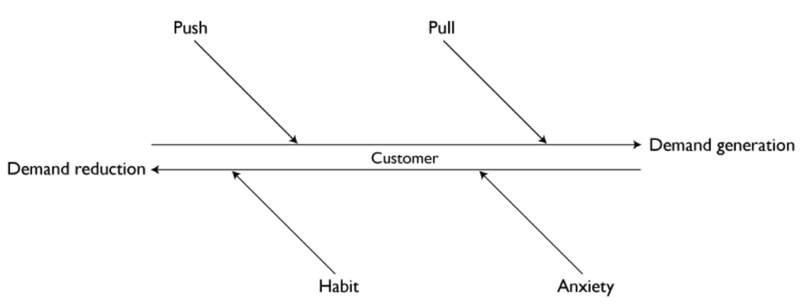
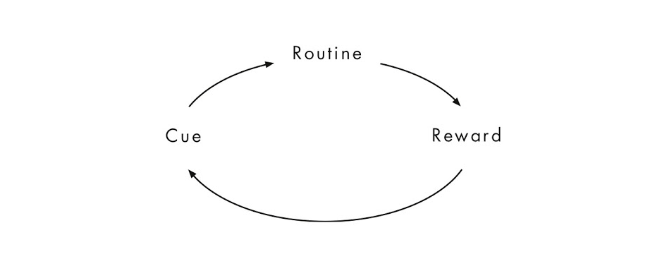
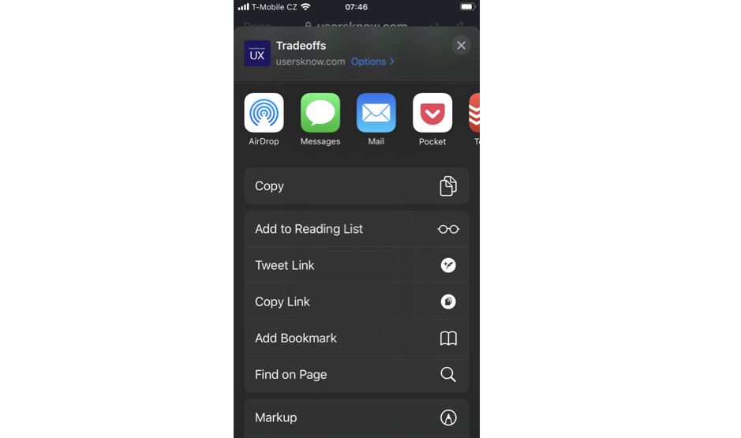
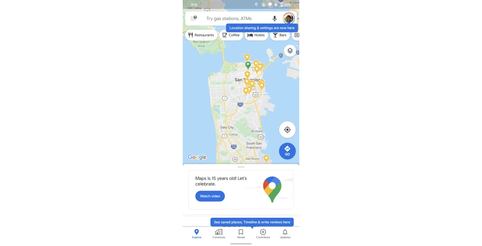

Your product matches or even exceeds your competitors. People know about it, some even purchase it, but they don't use it. What's going on? It's likely that you didn't take people's habits and fears into account. I will show you how these two forces keep people from using your product.

## Jobs to be done and Big hires vs. little hires

In his book "Competing Against Luck", Clayton Christensen describes the Jobs To Be Done theory and with it the language to talk about them.

People have problems to solve – jobs to be done. And they hire solutions for them. Each time you hire a solution though, you have to fire the current one. Even if the current solution is doing nothing.

What does hiring a solution mean exactly? There are two kinds of hires: big and little.

"Big hire" happens when people go and buy or get the product. They bring it into their lives. But even when people buy the product, the battle's not won. The purchase of a product doesn't guarantee that people will use it.

It's the actual use that we can call a "little hire". Successful products not only convince people to do the big hire, but also solve the job to be done so well, that people actually use them (the little hire) repeatedly.

When no little hires happen after the big hire, the product is useless. Just think of the time you bought some cool new thing, maybe used it a couple of times and now it's collecting dust on a shelf. Or an app you excitedly purchased only to launch it once or twice and never touched it again. On average, one in four apps is abandoned after a single use.

## Opposing forces

Christensen introduces to us two categories of opposing forces that generate and reduce demand for a solution.

_(Diagram by [Alan Klement](https://jtbd.info/the-forces-of-progress-4408bf995153))_

Most teams focus on the demand-generating forces and work on making their product more attractive.

We're going to look at the demand-reducing side of the equation. There are always two forces at play keeping people from switching to a different solution:

- Anxieties
- Habits

Notice how I specifically said "different solution". When you offer people a new solution—your product—you might see all the ways it's better and how people can be so much more efficient with it etc.

People might see something else: the need to learn something new or the fear of the new solution not having everything their current solution has. And even when people do the big hire, their habits can keep them from actual use.

Let's look more closely at these two forces—anxieties and habits—so that we can then understand what teams can do to overcome them.

## The story of a phone upgrade—that wasn't

Let's see how these forces play out in my own life.

I have an iPhone 7 which I got a couple of years ago. Several generations of amazing phones have come out since then. Faster phones with better displays, better cameras, better everything. The pull of the new is pretty strong. At the same time, my phone ages, it's battery life degrades and it barely lasts a day. That creates a push toward a new solution.

It might seem like upgrading should be a no-brainer, right?

Well, it isn't. I'm very comfortable with this phone. It does everything I need. Apart from the battery life, it's still running very well. I can comfortably use it with just one hand when I need to – typically in public transport while holding onto a handle. It also fits into my pocket neatly. I have a great cover that protects it nicely. And I'm just so used to it.

As newer phones keep coming out every year, I ponder an upgrade. But each year my habits and anxieties about the new keep me from doing the switch. I could afford a new phone, but I keep thinking about things like:

"_My current phone still works fine so I probably don't really need a new one. Those new phones seem kind of big. What if I won't be able to use it single-handed and it will fall out of my hand? What if it won't fit into my pockets? And I will have to learn the new navigation gestures. I will also lose TouchID to which I'm so so used..._"

You can see why I get pretty anxious when thinking about getting a new phone.

## Anxieties

In my story, I fear that a new phone might slip out when I would use it with just one hand. That's exactly the kind of anxiety that might just tip the balance in favour of the demand-reducing forces.

Anxieties are likely to arise before the big hire. Until you actually hire a new product, you're unsure if it will help you get a job done. Alan Klement, author of When Coffee and Kale Compete, calls this anxiety-in-choice.

That's why people can spend so much time doing the research before buying something. They look at reviews to see if the product nails the job for other people and if it's the same job that they have. They visit stores to try the product out.

These are strategies to get rid of the anxieties people feel when they're considering a different solution. And teams should be aware of them and address them properly.

### Addressing anxieties

The very first step to overcoming any anxieties people might have is knowing what they are. While that seems obvious, the research that can provide that insight is often skipped.

It's important to really understand your users' jobs to be done. It would be a mistake to focus only on the functional dimension of a job though (i.e. what needs to be done). The emotional dimension is crucial for identifying what people might be anxious about.

Only with that deep understanding can you go and address these anxieties.

What you might find is that more often than not, addressing anxieties is more about the service rather than the product itself. The service around the product can inform and re-assure people about how the product can solve their job to be done.

If I'm anxious that a new, bigger phone might slip out of my hand, the manufacturer might not necessarily have to start producing smaller phones. It can be enough to visit a store where I can hold the phone in my hand and see if my anxiety is warranted.

But sometimes also features can help with addressing anxieties. Like reachability on iOS.

_Reachability is exactly the kind of feature that mitigates my anxiety_

The key to success here is to enable people to find out as much as possible about your product before they do the big hire. Knowing what people are anxious about, you can highlight things about your product which address that.

What you can do specifically:

- Help people visualise the progress they want to make.
- Make them see how your product will help them get their jobs done.
- Enable them to try it out risk-free.

## Creatures of habit

Let's turn to the second force: habits.

Study about habit slips by USC found that "_consumers were likely to resist products that require some change of habit, but they cottoned onto products that fit easily into existing routines_". You have to know that "**_even if consumers like a new product and want to use it, they won't do so if it conflicts with their habits_**."

People have a strong tendency to slip back into their old habits even when they're trying to adopt something new. It's easy to fall back on our existing routines. We are indeed creatures of habit.

The thing with habits is that they might not really stand in the way of people buying your product. You might be able to persuade them to do the purchase (big hire). That's also where teams might stop and be happy with the result. They would be stopping short.

It's the actual use (little hires) where habits tend to generate real resistance against new products. That resistance can actually be passive – even when people like the new product, they tend to slip into their established habits.

What are teams left to do? Get people to form a new habit or break an existing one?

### Working with habits

Forming new habits is hard. If you've tried to make a habit out of flossing or meditating, you probably know that. It's hard enough for ourselves and even harder for companies to try and nudge us in the direction of forming a habit.

And only one thing is harder than creating a new habit: breaking an existing one. When people have already hired a solution to their jobs to be done and developed a habit around using it, it can be very hard to steer them towards a different solution. And the longer the solution has been in place, the tougher the challenge.

The old adage says that if you can't defeat them, join them. And that's exactly the kind of strategy that can help with habits. Rather than trying to establish a completely new habit or break an existing one, it can be more efficient to piggy-back on an existing habit.

Therefore, understanding your user's habits will inform your strategy.

You might be familiar with the habit loop, popularised by Charles Duhigg in his book The Power of Habit:

It's the first part—the cue—that's most important to working with habits in regard to product adoption. Only when you identify what the cue is for people can you try to become part of the routine.

A good example can be Pocket, the service for saving articles to read. With their extensions, they successfully integrate into their users' routines. The cue is that I want to share a link. The routine is that I open the Share dialogue. When I do, Pocket is right there just a tap away:

The takeaway is twofold:

- Make sure you understand your user's habits and routines.
- Make the existing habits your ally instead of fighting against them.

## Being your own competition

We've been looking at anxieties and habits in regard to different competing solutions. But these forces play their role on a feature-level too. You can be your own competition. If you're introducing a new feature to your product or replacing an old one, you absolutely have to take those forces into account.

Consider Google Maps. For a long time, the app has had a hamburger menu where you would find your saved places etc. Recently Google decided to bet on the tabbed navigation:

What you'll notice is that the—now-defunct—hamburger menu was still there (until very recently, when it was removed completely). That's because Google acknowledged people's habit of using the menu. When people tapped it, they were nudged toward the new navigation elements.

The app used the cue—seeing the hamburger menu—to introduce a new mode of navigation. This way, Google was able to get people used to the tab menu and gracefully remove the hamburger menu.

## Conclusion

We've seen that habits and anxieties play an important role in product adoption. They're invisible forces that keep people from using products. Teams need to acknowledge these forces and find ways to overcome them.

We've explored two strategies for that:

- Researching jobs to be done and addressing uncovered anxieties not only in the product itself but in the whole service around it.
- Working with habits rather than against them. Trying to fit into an established routine is more efficient than building completely new habits or going against existing ones.

Go out there, learn about your users' jobs to be done, their anxieties and their habits. It might just help you to make your product successful.

* * *

#### References

(1) Competing Against Luck by Clayton Christensen [https://www.amazon.com/dp/0062435612/ref=cm\_sw\_em\_r\_mt\_dp\_U\_EvAHEb66VBW2G](https://www.amazon.com/dp/0062435612/ref=cm_sw_em_r_mt_dp_U_EvAHEb66VBW2G)

(2) The Forces of Progress by Alan Klement [https://jtbd.info/the-forces-of-progress-4408bf995153](https://jtbd.info/the-forces-of-progress-4408bf995153)

(3) [https://www.vox.com/2015/6/13/11563532/one-in-four-mobile-apps-are-abandoned-after-a-single-use](https://www.vox.com/2015/6/13/11563532/one-in-four-mobile-apps-are-abandoned-after-a-single-use)

(4) [https://news.usc.edu/101754/old-habits-can-affect-the-adoption-of-new-products/](https://news.usc.edu/101754/old-habits-can-affect-the-adoption-of-new-products/)

### Let's start a conversation

What's your experience with these invisible forces and product adoption? I'd love to hear your thoughts:

[Tweet to @amrancz](https://twitter.com/intent/tweet?screen_name=amrancz&ref_src=twsrc%5Etfw)

