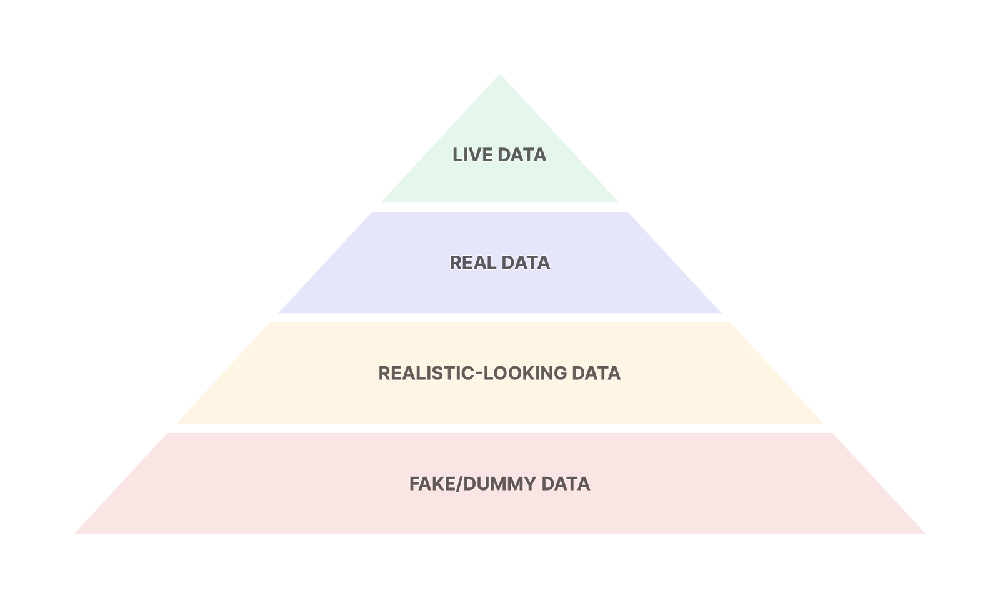
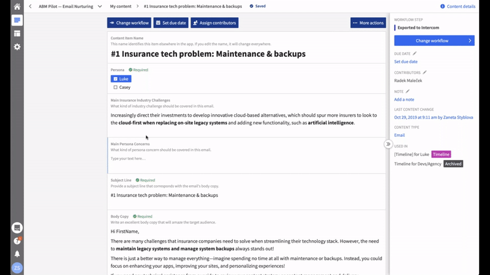
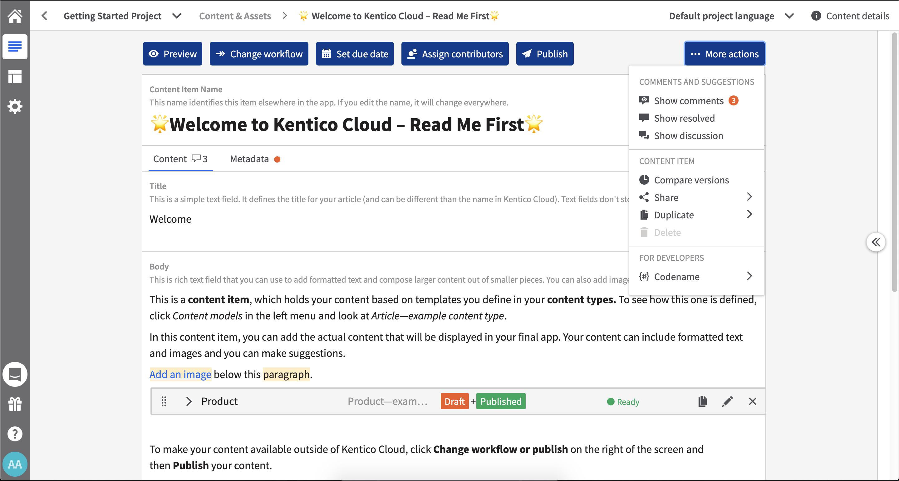

_This article was originally [published on UX Planet](https://uxplanet.org/prototype-with-live-data-get-better-results-292f9fa91b38)._

Live-data prototypes can step in when classic prototypes with real data may not be enough. They also bring developers into the design process. Are they decidedly a superior way to prototype? We’ve tried them out a couple of times in Kentico and here’s what we learned.

## What are live-data prototypes

If you’re a designer, you’re probably familiar with a myriad of prototyping tools: from paper through Invision to Framer. If you’re a unicorn who can also code, you might have experience with prototyping in HTML/CSS/JS as well. And some people are even [prototyping in Xcode](https://thoughtbot.com/blog/xcode-as-a-prototyping-tool-for-designers) (1).

In Kentico, we’ve most often used prototyping in Indigo, Axure or Sketch/Figma. Last year though, we started trying out live-data prototypes for some features and improvements we’ve been working on. What are live-prototypes, you might wonder?

The idea has actually been around for quite some time: back in 2011, Marty Cagan [wrote about them](https://svpg.com/product-discovery-with-live-data-prototypes/) (2). Here's the idea in a nutshell:

Live-data prototype lives in code, often on top of an existing product. It’s usually more interactive than traditional prototypes, and — most importantly — uses live data.

The last bit is key because there are situations where you need live data to test something out.

Let’s now look at the difference between live data and real data to avoid any confusion.

## Live data vs. real data

Live data is the user’s own data. Real data might be real, but not necessarily relevant to a particular user.

Think of it this way: live data is more relevant than real data, which is more relevant than realistic-looking data, which is more relevant than fake/dummy data.

Of course, you might not have any user-relevant data just yet. If you do though, they will be on the top spot of the data-relevance hierarchy.

_The data-relevance hierarchy for prototyping: Live data > real data > realistic-looking data > fake/dummy data._

Prototyping with real data has been all the rage for a few years now with tools like Framer leading the way.

It’s great to use real data, there’s no argument about that. But it might not be enough in certain cases. You might need the user to see their own live data in the prototype so that something can be properly tested.

Live data gives the user better context when you’re testing: they’re in their environment and the content is familiar because it’s theirs. With real data (or realistic-looking data; I feel the terms are often used interchangeably), it might not be as relevant if the data are not actually their own.

I hope the difference is clearer now. Let me now tell you about hands-on experience with live-data prototypes.

## Case study: Validating a notifications feature with a live-data prototype

Recently, we’ve been working on introducing in-app notifications to Kentico Kontent. Initially, we’ve created just a quick mockup that showed several types of notifications and tested it by showing it to some internal users. It’s a good first step, but it had its shortcomings: users saw some realistic-looking data in the mockup, but they couldn’t really relate to them. They had a hard time imagining that some action could actually occur because they weren’t familiar with the content they were supposed to be notified about.

At roughly the same time, we were discussing in our UX team which prototyping tool we wanted to be using as a team in the future. Suddenly, a radical idea floated up:

Do we, designers, always have to prototype? Why can’t whole product teams prototype?

_(Small note here: in Kentico, we work in small product teams consisting of several developers (one of whom is leading the team) and one UX designer.)_

After debating this option for a while, we agreed we would try prototyping in teams. That basically means that developers would create the live-data prototype with the help of a UX designer. And in-app notifications was the first project where it made sense to use it.

### “Selling” the idea to developers

We were two designers working on the feature and we met with a product team who was meant to develop it to discuss what we wanted to do. This was completely new to them and so it took a bit of explaining for the idea to fully click.

Developers on the team initially thought way more work would be needed for this prototype than we initially imagined. They talked about creating notifications based on actual events in the product. We had to explain this wasn’t necessary.

What we needed was for users to see real content items which the notifications were supposed to be about, but the events didn’t have to be real. However, if the fake event was meant to be initiated by other users (e.g. a user commented on some content), those users would have to be real.

The idea was to notify about fake events, but in real content by real users. There were also a couple of other trade-offs, but this was the key idea for the prototype. The team estimated it to take about a week to get it done, which actually isn’t much longer than it would take us, the designers, to prototype it in a dedicated tool with the level of interactivity we had in mind.

After that, the team got to work.

_Here’s what the prototype eventually looked like. The notification panel was the actual prototype built on top of the rest of the product._

### Usability testing with a live-data prototype

With the prototype finished, the team deployed it so it could be easily accessed via a standalone URL. This was important so that no special set up was needed during usability testing.

One thing we were initially worried about was that participants might not be comfortable logging into their accounts, especially with the testing session being recorded. Thankfully, this turned out not to be a problem at all.

During the actual testing, it was immediately clear that participants could relate to what they were seeing in the prototype. They could see their colleagues' names and the content items they recently worked on. The prototype set up the context perfectly. This enabled some key insights.

For instance, one participant was used to working heavily with language variants of their content items. In the prototype, as they saw the titles of their content, they were missing the language variant info they are used to. If the prototype contained “only” real data, this kind of insight might not have happened, because that data wouldn’t have been relevant to this participant’s use case.

A short clip from the usability testing capturing the moment we discovered a button click area was too small.

## Lessons from prototyping with live-data

This has been a very interesting experience for us — not just UX designers, but whole product teams. We were able to test features on live-data and get some valuable insights from it.

There are a couple of things we learned:

### 1\. User testing with live data gives much better results

As I explained at the beginning of this article, when users work with their data and their content it’s much closer to reality and the insights you get from observing them are much richer.

### 2\. Know when to use them

That being said, live-data prototypes are not the holy grail. They’re somewhat more expensive on resources than classic prototyping and in many cases, the benefits won’t justify the cost.

You should think hard about the need for live data in your specific case, before committing to this type of prototyping.

The best use case for live-data prototypes is for validating functionality that is tightly tied to user’s data (e.g. notifications). When user's own data aren't the meat of what you're building, I would say that using real data will be enough.

In some circumstances, live-prototypes can also serve to enable users to try out a new functionality over an extended period of time.

Example of another functionality that started out as a live-data prototype: quick actions on top of a content item.

### 3\. Great way to include the whole team in the design process

We have this mantra in Kentico: “Whoever gets closer to customers wins.” Part of that is including developers in the design process and this way of prototyping is great for doing that.

On top of this, we also made sure that there was always one developer from the team to observe the usability testing sessions.

## Practical tips

You might be excited to try prototyping like this with your team. That’s great! Let me give you a couple of tips to make the process smoother:

### 1\. Explain the difference between a prototype and production code

Marty Cagan addresses this issue in [another article](https://svpg.com/live-data-prototypes-vs-production/) (3). Teams can have a tendency to over-engineer this kind of prototype which can lead to a lot of waste.

You have to be very clear that what your team is doing with this prototype might not actually be used. That means your bar for quality and performance can be much much lower.

### 2\. Limit the scope

You don’t need to solve for every single interaction or edge case and you can mock _some_ data that are not critical for validating your hypotheses. Always be aware that you are not building the real thing just yet.

### 3\. Expect the worst during usability testing

I mentioned that we anticipated that our participants might not be OK with showing their data during the usability testing sessions. For that case, I prepared a separate app session with a dummy project. Luckily, we didn’t have to use it. And although that scenario would go against the core idea of a live-data prototype, you have to be ready for anything.

## Conclusion

Our experience with live-data prototypes has been a success so far. While it took some explaining and persuading to get the team on board with the idea, the results were definitely worth it. It enabled uncovering some important insights during usability testing and involving our developers in the process.

However, live-data prototypes are not a one-size-fits-all way of prototyping. There are still many situations where traditional prototypes make more sense. Nonetheless, it’s great to have both in your toolkit.

## References

(1) [https://thoughtbot.com/blog/xcode-as-a-prototyping-tool-for-designers](https://thoughtbot.com/blog/xcode-as-a-prototyping-tool-for-designers)

(2) [https://svpg.com/product-discovery-with-live-data-prototypes/](https://svpg.com/product-discovery-with-live-data-prototypes/)

(3) [https://svpg.com/live-data-prototypes-vs-production/](https://svpg.com/live-data-prototypes-vs-production/)
