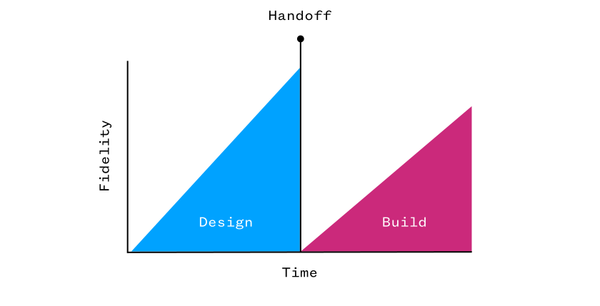
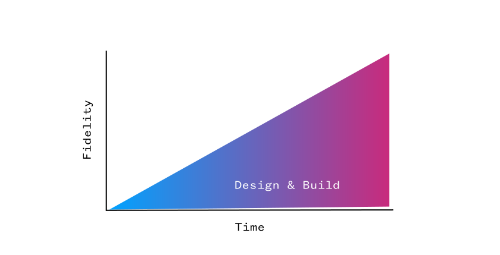

I am very excited about the design tools of tomorrow.

Tools like [Framer](https://www.framer.com/), [Modulz](https://www.modulz.app/) or [Clutch](https://clutch.io/).

They're all transforming the design tool landscape away from the pixel-pushing paradigm. And that's great!

Pushing pixels is nice. It's also wasteful. When you're designing a mockup, you're creating an image that someone will take and spend a lot of time recreating in code from scratch. And thus render that image obsolete, left to be updated again and again.

Dan Eden visualised this perfectly in his article [Where We Can Go](https://daneden.me/2019/08/27/where-we-can-go/):

What we should strive for is a more seamless approach:

_Images credit: [Dan Eden](https://daneden.me/)_

That is exactly what the aforementioned tools will allow us to do.

There's one thing those tools have in common: they're providing a way to visually manipulate code components. Right now, most of these tools work with React – one of the most popular Javascript frameworks right now.

And sure, they're doing their best so that we, designers, can do as much as we can visually, without touching the underlying code. That's definitely a good approach so that the learning curve is minimised and the tools are accessible to more designers.

I believe, however, that designers with the ability to code will get the most out of these tools of tomorrow. They'll be able to leverage these tools to the max.

So I'm learning to code. Javascript specifically, looking to learn React next. But the specifics don't really matter here.

What matters is that pixel-pushing seems to be a way of designing that will not be around much longer. Designers of tomorrow will use code and tools like Framer or Modulz (or whatever else that will gain traction) to be much more efficient and finally bridge the gap between design and development.

I can't wait for that to happen. The day the design community will be able to finally say: "Goodbye pixel-pushing. It was fun, but it's time to move on."

And that's why I'm learning to code. To be ready when that day comes.
