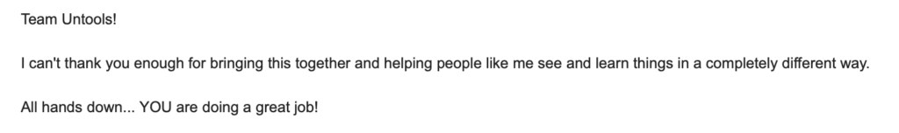
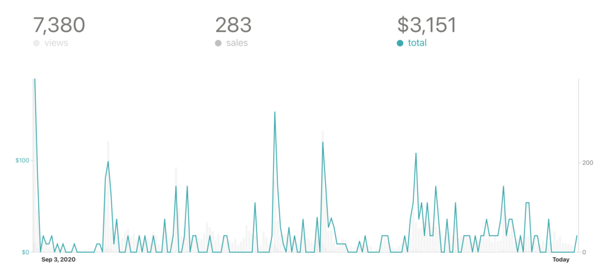

It's been over a year since I started building [Untools.co](http://untools.co) and almost 10 months since the launch.

Since then, over 182,000 people visited the website, over 4,500 people are subscribed to the newsletter and I made over $3,000 from selling extra products around it.

Here's the story from the inside and what I learned from the journey so far.

### Solve your own problem...then share it with the world

I started building Untools for myself. I had been collecting some useful thinking tools and frameworks but there was no place to bring them together. Having this central place could allow me to go in and grab the tool I needed to solve a problem or make a decision.

My collection initially lived in Notion but it dawned on me that this was wasted potential. I decided to build it as a website so that I could share it with the world.

Before launching, I had no idea how many people would find this useful. My thinking was: 'if I help at least one person with this, it's worth it'. I mean, all of those thinking tools could be found on the web already, right.

The act of launching the project publicly unlocked a lot of potential. I suddenly saw how many people shared my problem and how many found these tools so valuable. Just because the content already existed in another form didn't mean my work wouldn't bring value – quite the opposite!

Let these kind words of one Untools reader be the evidence of that:

It can be scary to share your work with the world. The worst case scenario is that nobody notices. The potential for new opportunities when you hit publish, though, is huge.

### Curation is underrated

From the beginning, my philosophy for Untools was to keep it small. I launched with about 12 thinking tools. I've added only 6 since the launch.

Same with the newsletter: I've only sent out 11 emails so far. That's ~1 email/month. I only send an email when I publish a new tool or when there's a meaningful update to the project that I consider valuable for my subscribers.

I've seen too many maximalist projects: trying to collect or create as much content as possible. Repositories with dozens of categories and hundreds of links. Weekly newsletters that scramble to gather enough content each week. I'm not a fan of this.

I think that in today's world of information abundance, curation is really important yet underrated. Building Untools has taught me that. People don't need more content. People need less but more quality content.

### You don't need to be a developer to build something

I already mentioned I started collecting the content for Untools in Notion. And my very first attempt to build it was with Webflow – a no-code tool for building websites.

Ironically, I found Webflow too complicated and decided to code it on my own with GatsbyJS. No previous experience with it. I only had a completed Javascript course for beginners going for me.

There were some rough moments of frustration and despair before I figured some things out, let me tell you that. Yet it was also a lot of fun and I learned so much! I'm not a developer, though. Never have been and certainly don't consider myself to be after this.

While I eventually chose the own-code approach, sticking with a no-code tool like Webflow would've definitely been a sound option as well. And a lot of people are going that way, which is great.

You don't need a title or a ton of experience as a permission to build something. Just start, learn along the way and enjoy it.

### Make $1 on the internet

When I launched Untools, I had no intention of monetizing it. I was just happy I could offer the world some value.

I never wanted to serve ads on the site or lock the content behind a paywall. [And that's still out of the question](https://twitter.com/amrancz/status/1362843429064040452?s=20). But it became clear I needed some revenue stream to support the costs of running the project and the time I was putting in.

Jack Butcher's message of making $1 on the internet was what nudged me to do it:

https://twitter.com/jackbutcher/status/1313162815780392961?s=20

This is why I created [Untools for Worksheets and Untools for Notion](https://untools.co/templates/). I wanted to create something that would help people put the thinking tools to practice and in turn help me run the project.

My expectation was that the sales of these would cover the necessary costs like domain and newsletter service. At best, I thought I could make a few dollars here and there.

To my surprise, these products have made over $3000 since launching them with fairly little promotion:

These are not life-changing numbers, of course. It doesn't mean I can quit my job now. But it means there's value in that content and I see more opportunity here.

If I could give my last-year self a piece of advice, it would be: Don't be afraid to monetize what you build. But do it in a way that's meaningful for you and your users.

For me, that meant building something of extra value without running any ads or putting content behind a paywall.

### What's next for Untools?

I'll continue to run the project and occasionally add a new thinking tool that I find to be really valuable.

At the same time, I see a big opportunity in making these thinking tools more practical. In enabling people to better take advantage of those tools to really improve their thinking. That's what I'll be working on now.

You can [follow me on the journey on Twitter](https://twitter.com/amrancz).
