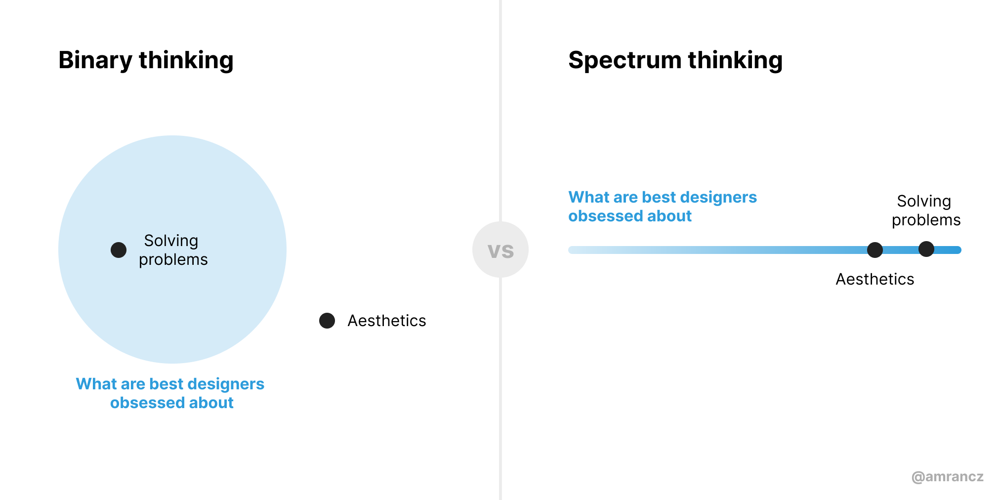

A recent tweet sparked some controversy on the Design Twitter.
Lots of people took to replies and quoted retweets to express their disagreement, but also to concur.

Here's the tweet:

<Tweet
  tweetLink="ormanclark/status/1487425821149208580"
  align="center"
  theme="dark"
/>

Sounds controversial to you? I believe it shouldn't.

In this post, I don't want to discuss the content of the tweet too much, though. Instead, I want to look at why it was so controversial. 
To be more precise, why the tweet was _interpreted_ as such and why it doesn't need to be that way.

With this, I'm trying to see how we could engage in better conversations as a community.

## Binary thinking

The first thing going on there is binary (or "black & white", "either/or") thinking.
People often apply it unconsciously and it's much easier to think this way than to consider more nuance.

You'll notice in the reactions to the tweet that many people disagree by pointing out that both solving problems and aesthetics matter to designers.

They did so because they likely read the tweet as two statements:
1. Best designers are obsessed with problems.
2. Best designers are not obsessed with aesthetics.

Read this way, the outrage is understandable. Designers care about aesthetics a lot. To imply otherwise is heresy.
But I believe the tweet never meant to say that.

How could we collectively think in a way that wasn't so divisive?

### Enter spectrum thinking

I'd like you to consider a different thinking style here.

What if the author simply wanted to say that solving problems is more important than aesthetics in design? 
What if the statement was supposed to be relative, not absolute?

If we apply spectrum thinking to it instead of a binary one, the tweet ceases to be controversial so much.

It's much easier to agree that designers are obsessed with both, but perhaps the best obsess about solving problems a little more than aesthetics.

Even if you believe tha aesthetics are supremely important, it's easier to have this kind of discussion over the spectrum than over the (perceived) statement that designers don't obsess about aesthetics at all.

Spectrum thinking can help us have more nuanced and objective conversations this way. There's a really good [blog post on binary vs. spectrum thinking](https://ozchen.com/binary-vs-spectrum-thinking/) if you'd like to explore it more.

I want to follow with another reason why things like the tweet above end up more controversial than intended or necessary.

## Invisible contexts

Every single person entering a discussion brings their own set of experiences and beliefs with them. Their own context. This context often explains the opinions people hold.

Let me share an unpopular opinion of mine: Visual design skills are overrated and they're not as important in day-to-day jobs as often presented or required in interviews.

Now, this is probably going to be controversial to a lot of designers. Some might speak out in stark disagreement. This could easily turn into a heated debate.

When we engage in such discussions, we often fail to realise the all sides are speaking from different contexts. Those contexts are usually unvoiced, invisible.
But they're critical to understand all sides of an argument.

Our contexts and environments shape our opinions and beliefs. When we don't make them explicit, many of our opinions will be very controversial to people who don't share our context.

In my example above, I'm speaking from a context of designing a fairly mature B2B SaaS product, with established visual language and a robust design system.

Contrast it with a context of an agency designer who brings new products to life, having to come up with new visual languages all the time, maybe even create new design systems from scratch.

Visual design skills are much more important in the latter context. But debating the original statement without making the context explicit would be a disaster.

Sadly, that's what often happens on social media. People share hot takes but usually fail to offer anything that explains why they hold such an opinion. Others are quick to disagree or even criticize (again, without sharing the context that drives their opposing opinion). 
Social media get great engagement, but people get anger, anxiety and other bad feelings.

Simply being mindful of the invisible contexts problem can help here. At the very least, it makes us more understanding of different opinions. At best, it reminds us to share more of our reasoning.

## Leveling up our discussions

I've looked at two concepts that drive controversy, divisiveness and outrage in our online discussions:

- Binary thinking
- Invisible contexts

Shifting from binary thinking to spectrum thinking can help us have more nuanced, objective discussions.

Being mindful of invisible contexts helps us be more understanding. Sharing those contexts might just make some seemingly controversial opinions less so.

Altogether, it can level up the discussions we have in our community.